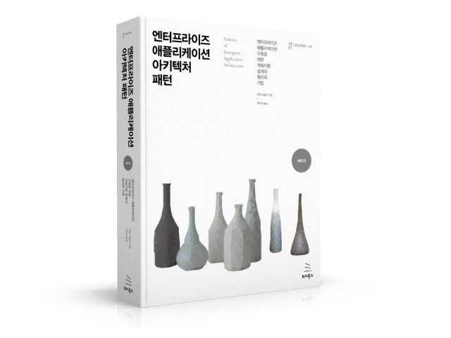

# Enterprise-Application-Architecture-Pattern

    

## 💻 공부는 Notion 개인 페이지를 통해 정리하였습니다.

 

## "엔터프라이즈 애플리케이션 아키텍처 패턴"
### Chapter 01. 이야기
[01장. 계층화](https://www.notion.so/01-01444e89e9a04e0597a5262fe7d7de47?pvs=21)

[02장. 도메인 논리 구성](https://www.notion.so/02-b32c5dae088b484d90b1eb2ffd8c0f4b?pvs=21)

[03장. 관계형 데이터베이스 매핑](https://www.notion.so/03-3d138a7cad9d4182bd1844342faa4c74?pvs=21)

[04장. 웹 프레젠테이션](https://moondongmin.notion.site/04-99db5782e7dc46979ea9217411e56b41?pvs=4)

[05장. 동시성](https://moondongmin.notion.site/05-31dd01c814c14b4a9a1b768ec8b39b29?pvs=4)

[06장. 세션 상태](https://moondongmin.notion.site/06-fd5f8310f4f44f2fb98f173f024be571?pvs=4)

[07장. 분산 전략](https://moondongmin.notion.site/07-89a16fd1a3e449c9939125a97e66f228?pvs=4)

[09장. 도메인 논리 패턴](https://moondongmin.notion.site/09-a1ac2c71390e426281b5c0aefa2851d7?pvs=4)

[10장. 데이터 원본 아키텍처 패턴](https://moondongmin.notion.site/10-103357c44e5680cebd1edf36634c3790?pvs=4)

[Chapter 12장. 객체-관계형 구조 패턴](https://moondongmin.notion.site/Chapter-12-11e357c44e5680dab0e1c86cc952a1b5?pvs=4)

[18장. 기본 패턴](https://moondongmin.notion.site/18-d515be9cb2934f06a1ca7a9b625892e5?pvs=4)

## "UML 실전에서는 이것만 쓴다"
[클래스 다이어그램](https://moondongmin.notion.site/3-49871219a6524bd3aea9cf8162e5b6d1?pvs=4)

[시퀀스 다이어그램](https://moondongmin.notion.site/4-6c0468dcce034d44a5dd1003867b83aa?pvs=4)

[유스케이스](https://moondongmin.notion.site/5-bc07da4458ab4b7e876a4741a3ca8e5a?pvs=4)

[객체 다이어그램](https://moondongmin.notion.site/9-90e09ecfc2c242ccae1fc1aa0bcbc0a4?pvs=4)

[상태 다이어그램](https://moondongmin.notion.site/10-e514c0fef0444a93bdcc6457122a6405?pvs=4)

